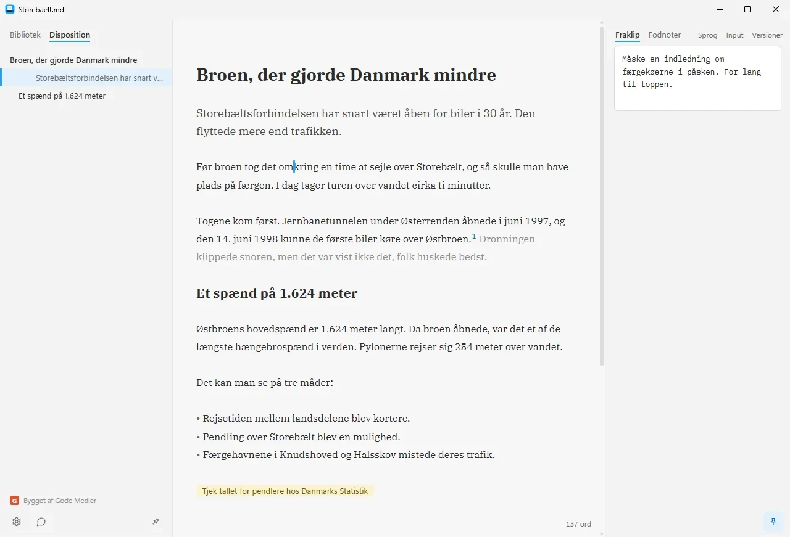

# Gode Tekster

Et gratis skriveprogram til Windows. Du skriver i markdown, og teksten står formateret, mens du
skriver. Sætninger, du er i tvivl om, kan dæmpes i stedet for at blive slettet. Teksterne er
almindelige `.md`-filer i dine egne mapper. Ingen konto, ingen database, ingen sky.

Når du beder om det, kan programmet skære, faktatjekke og renskrive via dit eget abonnement hos
Claude, ChatGPT, Gemini eller Mistral. Intet ændres i filen, før du selv klikker.

Programmet findes på dansk og engelsk. Stiltjekket og ordklasserne i farver virker kun på dansk.

**[English version](README.md)** · **[Hent programmet](https://tekster.godemedier.dk)**



## Hent

Programmet ligger på [tekster.godemedier.dk](https://tekster.godemedier.dk). Der er en installer
og en flytbar udgave, der kører uden installation. Begge opdaterer sig selv, stille, når du lukker
programmet.

Programmet er ikke kodesigneret endnu, så Windows advarer måske første gang. Downloadsiden
forklarer, hvad du gør.

## Hvad det kan

- **Formateret, mens du skriver.** Markdown-tegnene gemmer sig, når markøren ikke står på linjen.
  Tabeller vises som tabeller, og du retter direkte i cellerne.
- **Dæmpet tekst, fraklip og noter.** Dæmpet tekst står i gråt og tæller ikke med i ordtal,
  eksport og print. Fraklip gemmer det, der skulle ud. Noter til dig selv og fodnoter bor i filen.
- **Almindelige filer.** Programmet læser og skriver iA Writers forfatterskab, så filerne kan gå
  frem og tilbage mellem de to.
- **Taber ikke tekst.** Det gemmer halvandet sekund efter, du holder pause. Hvert gem er atomisk:
  først en midlertidig fil, så en omdøbning. Tidligere versioner gemmes, og retter et andet
  program i filen, mens den er åben, fletter Gode Tekster de to udgaver eller spørger først.
- **Kommandoer med »/«.** Skriv »/« for skabeloner og kommandoer. Mangler du en, beskriver du den
  med ord. Så bygger sprogmodellen den, og du ser en prøve, før du gemmer.
- **Ro.** Fokus, skrivemaskinerulning og Ro på, hvor skærmen er fyldt af teksten og wifi er
  slukket, til du går ud igen.
- **Ud af huset.** Print, PDF og Word med skabeloner. Word-filer kan trækkes ind og blive til
  markdown.
- **Søgning** i den åbne tekst eller i alle dine biblioteker på én gang.

Hele vejledningen følger med programmet og ligger i
[`src-tauri/welcome/vejledning.md`](src-tauri/welcome/vejledning.md).

## Privatliv

- Dine tekster går aldrig gennem Gode Medier. AI-kald går fra din computer direkte til den
  udbyder, du har valgt, med dit eget login eller din egen nøgle.
- Nøgler til Gemini og Mistral ligger i Windows Credential Manager, ikke i en fil.
- Programmet spørger `tekster.godemedier.dk` efter opdateringer to minutter efter start og
  derefter hver sjette time. Serveren ser versionsnummeret og din IP-adresse.
- Feedback sendes kun, når du selv skriver den. Efter et nedbrud spørger programmet én gang, om
  fejlloggen må sendes. Loggen indeholder aldrig tekst fra dine dokumenter.
- Serveren gemmer intet. Hele erklæringen står på
  [tekster.godemedier.dk/privatliv](https://tekster.godemedier.dk/privatliv).

## Byg det selv

Det kræver Windows, Node 24, Rust (`winget install Rustlang.Rustup`) og Microsoft C++ Build Tools
med C++-delen. Åbn en ny terminal efter installationen af Rust, ellers findes `cargo` ikke.

```
npm install            # installerer og armerer commit-tjekket
npm run tauri dev      # start programmet med genindlæsning
npm test               # typecheck og tests (TypeScript og Rust)
npm run tauri build    # byg installeren (src-tauri/target/release/bundle/nsis/)
```

## Sådan er det bygget

| Lag | Valg |
|---|---|
| Skal | [Tauri 2](https://tauri.app): en Rust-kerne og et WebView2-vindue. Kun Windows |
| Kerne (`src-tauri/src/`) | Rust: filer, biblioteker, historik, fletning, eksport, kald til sprogmodellerne |
| Flade (`src/`) | TypeScript og Vite. Ingen UI-ramme |
| Skriveflade | [CodeMirror 6](https://codemirror.net) med en egen udvidelse til live preview |

Fladen kan kun det, Rust-kommandoerne tilbyder. Den har ingen adgang til filsystem eller shell,
sikkerhedspolitikken (CSP) tillader ingen scripts udefra, og `claude.exe` og `codex.exe` startes
med en argumentliste, aldrig gennem en shell. Dokumentets tekst og hentede sider er data i
prompten, aldrig instruktioner.

Det meste af koden er skrevet med [Claude Code](https://claude.com/claude-code), mens jeg har
styret. Det kan ses på de enkelte commits.

## Dokumentationen

Dokumenterne er skrevet, så både mennesker og AI-agenter kan læse dem.

| Fil | Hvad der står |
|---|---|
| [`STRATEGI.md`](STRATEGI.md) | Hvorfor programmet findes, hvem det er til, og hvad det bevidst ikke skal kunne |
| [`ARKITEKTUR.md`](ARKITEKTUR.md) | Hvordan maskinen kører, og beslutningsloggen (ADR-0001 og frem) |
| [`AGENTS.md`](AGENTS.md) | Arbejdskontrakten for alle, mennesker og AI, der ændrer i koden |
| [`docs/struktur.md`](docs/struktur.md) | Filtræet, modul for modul |
| [`CONTRIBUTING.md`](CONTRIBUTING.md) | Sådan melder du fejl og foreslår ændringer |
| [`SECURITY.md`](SECURITY.md) | Sådan melder du et sikkerhedshul |

## Bidrag

Fejl og idéer er velkomne som [issues på GitHub](https://github.com/godemedier/gode-tekster/issues)
eller på mail til troels@godemedier.dk. Repoet her er et spejl af
Gode Mediers egen git-server, så pull requests kan ikke flettes direkte. Se [CONTRIBUTING.md](CONTRIBUTING.md).

## Licens

Copyright © 2026 Gode Medier v/ Troels Kølln.

Gode Tekster er fri software under GNU General Public License version 3 (GPL-3.0-only). Du må
bruge, ændre og dele programmet, også på arbejdet. Deler du en ændret udgave, skal den være under
samme licens, og kildekoden skal følge med. Hele teksten står i [LICENSE](LICENSE).

Navnet Gode Tekster og logoet er ikke omfattet af licensen (GPL-3.0 afsnit 7e). En ændret udgave
skal have sit eget navn.

Komponenterne, programmet bygger på, har deres egne licenser. De står i
[`src-tauri/resources/LICENSES.txt`](src-tauri/resources/LICENSES.txt). Ordklasselisten er bygget af
UD Danish-DDT og er under CC BY-SA 4.0.
